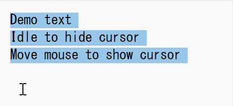
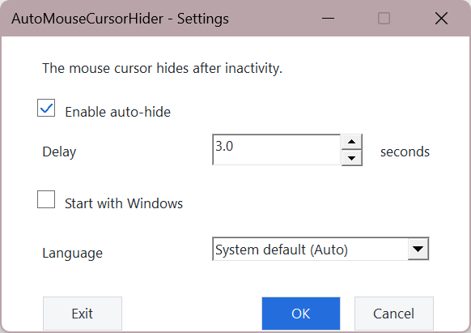
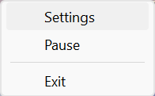

# AutoMouseCursorHider 🖱️

**A lightweight, native Windows utility that hides the mouse cursor when it stays still — and brings it back the moment you move.**

No installer. No .NET runtime. No administrator privileges. Just download one small EXE and run it quietly from the system tray.

[简体中文 README](README.zh-CN.md) · [Latest Release](../../releases/latest)



## Why AutoMouseCursorHider?

Designed for reading, writing, presentations, video playback, and any workspace where a stationary cursor gets in the way. It uses native Win32 APIs, stays out of your way, and restores the cursor safely when you move the mouse or exit the app.

## Features

- System-wide cursor auto-hide with immediate restoration on movement
- Adjustable delay from **0.1 to 3600 seconds** (default: **3 seconds**)
- Tray menu for Settings, Pause/Resume, and Exit
- Protection for Task Manager, elevated windows, UAC, and secure desktops
- Optional start with Windows
- English and Simplified Chinese interface
- Single-instance, portable, single-file executable
- No network connection, no data collection, and no administrator rights required
- Restores the system cursor when paused or exiting

## Screenshots

### Settings



### Tray menu



## Download and run

1. Download **[AutoMouseCursorHider.exe](../../releases/latest)** from Releases.
2. Double-click the file — no installation is required.
3. Find the icon in the notification area and right-click it to configure, pause, resume, or exit.

Windows SmartScreen may show a warning because the executable is not commercially code-signed. If the file came from this repository, choose **Run anyway**.

## System requirements

- Windows 10 or Windows 11
- 64-bit x64 system
- No .NET or Visual C++ Runtime required
- No administrator privileges required

## Build (developers)

Install Visual Studio Build Tools with MSVC, the Windows SDK, and CMake, then run:

```powershell
cmake -S native -B native/build -G "Visual Studio 18 2026" -A x64
cmake --build native/build --config Release
```

The executable is generated at `native/build/Release/AutoMouseCursorHider.exe`.

## Version history

- **v2.4.0** — Restores the cursor and pauses auto-hide over Task Manager and other elevated windows.
- **v2.3.0** — Keeps the cursor visible on UAC and secure desktops.
- **v2.2.0** — Added an Exit button to the Settings window.
- **v2.1.2** — Fixed Explorer/taskbar icon compatibility and refreshed the application icon.
- **v2.1.1** — Refreshed the application and tray icon with a larger mouse subject.
- **v2.1.0** — Added launch feedback, silent startup, tray settings, bilingual UI, and unified state.
- **v2.0.0** — Native Win32 rewrite.
- **v1.0.0** — Early version.

## License

No open-source license has been specified yet.
